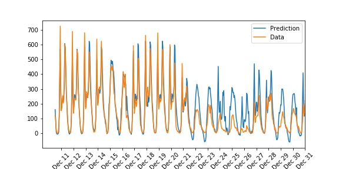

# Predicting Bike-Sharing Patterns
This is my implementation the first project in Udacity Deep Learning Nanodegree. 
In this project, I build a neural network from scratch to carry out a prediction problem on a real dataset!. The model
can be used to predict daily bike rental ridership. I implemented gradient descent, 
backpropagation, and other concepts that are important for the model. 

## Dataset
 The data comes from the [UCI Machine Learning Database](https://archive.ics.uci.edu/ml/datasets/Bike+Sharing+Dataset) and Udacity 
 repo can be found is [here](https://github.com/udacity/deep-learning-v2-pytorch/tree/master/project-bikesharing).
 ## Environment Settings
  - Python: '3'
  - Numpy: '1.12.1'
  - Pandas: '0.23.3'
  - Matplotlib: '0.23.3'
  
## Experimental Results

The training loss is 0.094 and the validation loss is 0.154.

Here, I use the test data to view how well my network is modeling the data. 

